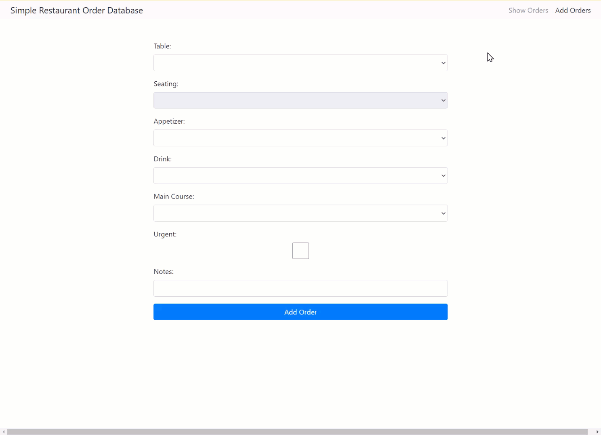
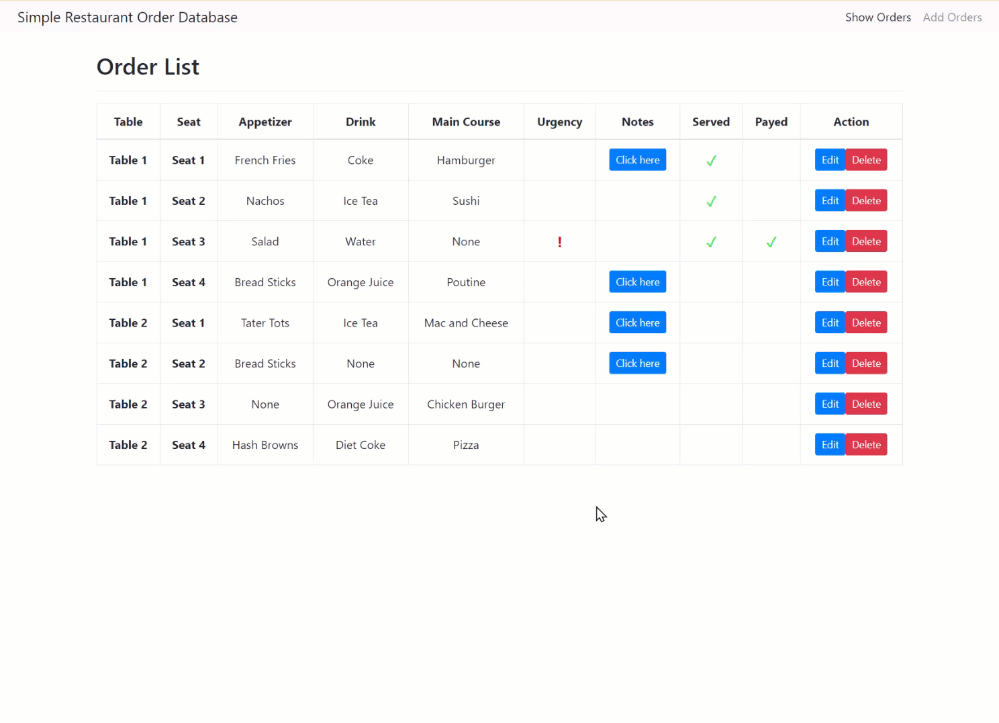

# About This Project / Me

The crux of this project was to emulate an interface and database that a restaurant could use to monitor the status of active/finished orders.

This project was a practice trial for me to learn how to develope full/MEAN stack apps with Angular 11. Having only written front-end apps at the time of this development, this was my first exposure to backend developement.

# Demo:

Adding an order.

Checking, editing and deleting an order.

